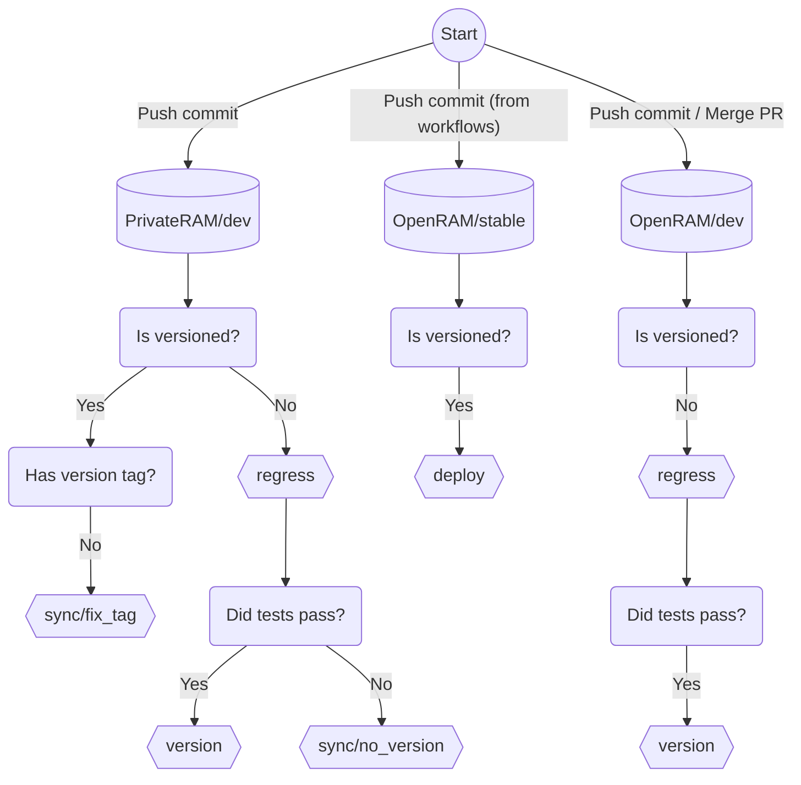

# How do the workflows work?

1. When there is a push to the private repo's 'dev' branch (private/dev),
`regress` workflow runs the regression tests if the commit is not versioned.
`sync` workflow runs and makes sure that the versioned commit has a tag if it is
versioned. See [important notes](#important-notes) to see what "versioned
commit" means.

1. If `regress` workflow fails on 'private/dev', `sync` workflow gets triggered
and it pushes the latest changes to the public repo's 'dev' branch (public/dev).
After this push, `regress` workflow will also run on 'public/dev'.

1. If `regress` workflow successfully passes on 'private/dev', `version`
workflow gets triggered. It creates a new version commit and tag, and pushes to
'private/dev', 'public/dev', and 'public/stable'.

1. When there is a push with new version to the 'public/stable' branch, `deploy`
workflow runs. It deploys the PyPI package of OpenRAM and creates a new GitHub
release on that repo.

1. If there is a pull request on either repo, `regress` workflow runs on that
pull request.

1. If there is a push to 'public/dev', `regress` workflow runs (it also happens
when pull requests are merged).

1. If `regress` workflow successfully passes on 'public/dev', `version`
workflow gets triggered. It creates a new version commit and tag, and pushes to
'private/dev', 'public/dev', and 'public/stable'.


## Important Notes

1. Workflows understand that the latest commit is versioned  with the following
commit message syntax.

    ```
    Bump version: <any message>
    ```

    Automatically generated version commits have the following syntax:

    ```
    Bump version: a.b.c -> a.b.d
    ```

1. `version` workflow only increments the right-most version digit. Other digits
in the version number must be updated manually, following the syntax above. Just
following this syntax is enough for workflows to create a new version
automatically. That means, you don't have to tag that commit manually.

1. `regress` workflow doesn't run if the push has a new version. We assume that
this commit was automatically generated after a previous commit passed `regress`
workflow or was manually generated with caution.

1. `regress` workflow doesn't run on branches named 'stable'.

1. `deploy` workflow only runs on branches named 'stable'.

1. `version` workflow is only triggered from branches named 'dev' if they pass
`regress` workflow.

1. `sync` workflow only runs on the private repo.

1. Pull requests merged on to 'public/dev' will also trigger `regress` and it
can create a new version.

1. Merging pull requests that don't pass `regress` workflow on the public repo
should be avoided since it won't update the private repo automatically. To
prevent merging by mistake, the dev branch can be protected in the GitHub
settings.

1. Merging pull requests on the private repo should be safe in any case. They
are treated the same as commit pushes.


## Flowchart


