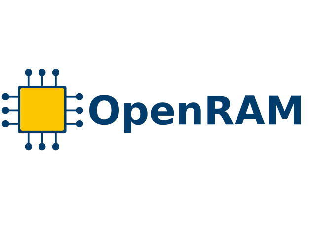
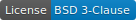
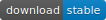
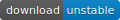
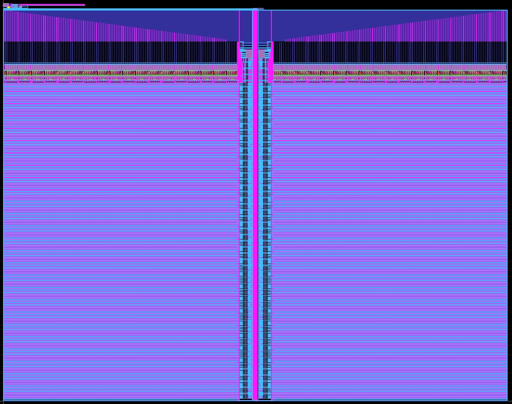

# OpenRAM

[](https://www.python.org/)
[](./LICENSE)
[](https://github.com/VLSIDA/OpenRAM/archive/stable.zip)
[](https://github.com/VLSIDA/OpenRAM/archive/dev.zip)

An open-source static random access memory (SRAM) compiler.

# What is OpenRAM?


OpenRAM is an award winning open-source Python framework to create the layout,
netlists, timing and power models, placement and routing models, and
other views necessary to use SRAMs in ASIC design. OpenRAM supports
integration in both commercial and open-source flows with both
predictive and fabricable technologies.

# Documentation

Please take a look at our presentation We have created a detailed
presentation that serves as our [documentation][documentation].
This is the most up-to-date information, so please let us know if you see
things that need to be fixed.

# Basic Setup

## Dependencies

Please see the Dockerfile for the required versions of tools.

In general, the OpenRAM compiler has very few dependencies:
+ Docker
+ Make
+ Python 3.6 or higher
+ Various Python packages (pip install -r requirements.txt)
+ [Git]

## Docker

We have a [docker setup](./docker) to run OpenRAM. To use this, you should run:
```
cd OpenRAM/docker
make build
```
This must be run once and will take a while to build all the tools.


## Environment

You must set two environment variables:
+ OPENRAM\_HOME should point to the compiler source directory.
+ OPENERAM\_TECH should point to one or more root technology directories (colon separated).

You should also add OPENRAM\_HOME to your PYTHONPATH.

For example add this to your .bashrc:

```
  export OPENRAM_HOME="$HOME/OpenRAM/compiler"
  export OPENRAM_TECH="$HOME/OpenRAM/technology"
```

You should also add OPENRAM\_HOME to your PYTHONPATH:
```
  export PYTHONPATH=$OPENRAM_HOME
```

Note that if you want symbols to resolve in your editor, you may also want to add the specific technology
directory that you use and any custom technology modules as well. For example:
```
  export PYTHONPATH="$OPENRAM_HOME:$OPENRAM_TECH/sky130:$OPENRAM_TECH/sky130/custom"
```

We include the tech files necessary for [SCMOS] SCN4M_SUBM,
[FreePDK45]. The [SCMOS] spice models, however, are
generic and should be replaced with foundry models. You may get the
entire [FreePDK45 PDK here][FreePDK45].


### Sky130 Setup

To install [Sky130], you must have the open_pdks files installed in $PDK_ROOT. 
To install this automatically, you can run:

```
cd $HOME/OpenRAM
make pdk
```

Then you must also install the [Sky130] SRAM build space and the appropriate cell views
by running:

```
cd $HOME/OpenRAM
make install
```

# Basic Usage

Once you have defined the environment, you can run OpenRAM from the command line
using a single configuration file written in Python.

For example, create a file called *myconfig.py* specifying the following
parameters for your memory:
```
# Data word size
word_size = 2
# Number of words in the memory
num_words = 16

# Technology to use in $OPENRAM_TECH
tech_name = "scn4m_subm"

# You can use the technology nominal corner only
nominal_corner_only = True
# Or you can specify particular corners
# Process corners to characterize
# process_corners = ["SS", "TT", "FF"]
# Voltage corners to characterize
# supply_voltages = [ 3.0, 3.3, 3.5 ]
# Temperature corners to characterize
# temperatures = [ 0, 25 100]

# Output directory for the results
output_path = "temp"
# Output file base name
output_name = "sram_{0}_{1}_{2}".format(word_size,num_words,tech_name)

# Disable analytical models for full characterization (WARNING: slow!)
# analytical_delay = False

```

You can then run OpenRAM by executing:
```
python3 $OPENRAM_HOME/openram.py myconfig
```
You can see all of the options for the configuration file in
$OPENRAM\_HOME/options.py

To run designs in Docker, it is suggested to use, for example:
```
cd OpenRAM/macros
make example_config_scn4m_subm
```

# Unit Tests

Regression testing  performs a number of tests for all modules in OpenRAM.
From the unit test directory ($OPENRAM\_HOME/tests),
use the following command to run all regression tests:

```
cd OpenRAM/compiler/tests
make -j 3
```
The -j can run with 3 threads. By default, this will run in all technologies.

To run a specific test in all technologies:
```
cd OpenRAM/compiler/tests
make 05_bitcell_array_test
```
To run a specific technology:
```
cd OpenRAM/compiler/tests
TECHS=scn4m_subm make 05_bitcell_array_test
```

To increase the verbosity of the test, add one (or more) -v options and
pass it as an argument to OpenRAM:
```
ARGS="-v" make 05_bitcell_array_test
```

Unit test results are put in a directory:
```
OpenRAM/compiler/tests/results/<technology>/<test>
```
If the test fails, there will be a tmp directory with intermediate results.
If the test passes, this directory will be deleted to save space.
You can view the .out file to see what the output of a test is in either case.

# Get Involved

+ [Port it](./PORTING.md) to a new technology.
+ Report bugs by submitting [Github issues].
+ Develop new features (see [how to contribute](./CONTRIBUTING.md))
+ Submit code/fixes using a [Github pull request]
+ Follow our [project][Github project].
+ Read and cite our [ICCAD paper][OpenRAMpaper]

# Further Help

+ [Additional hints](./HINTS.md)
+ [Documentation][documentation]
+ [OpenRAM Slack Workspace][Slack]
+ [OpenRAM Users Group][user-group] ([subscribe here][user-group-subscribe])
+ [OpenRAM Developers Group][dev-group] ([subscribe here][dev-group-subscribe])
+ <a rel="me" href="https://fosstodon.org/@mrg">@mrg@fostodon.org</a>

# License

OpenRAM is licensed under the [BSD 3-clause License](./LICENSE).

# Contributors & Acknowledgment

- [Matthew Guthaus] from [VLSIDA] created the OpenRAM project and is the lead architect.
- [James Stine] from [VLSIARCH] co-founded the project.
- Many students: Hunter Nichols, Michael Grimes, Jennifer Sowash, Yusu Wang, Joey Kunzler, Jesse Cirimelli-Low, Samira Ataei, Bin Wu, Brian Chen, Jeff Butera

If I forgot to add you, please let me know!

* * *

[Matthew Guthaus]:       https://users.soe.ucsc.edu/~mrg
[James Stine]:           https://ece.okstate.edu/content/stine-james-e-jr-phd
[VLSIDA]:                https://vlsida.soe.ucsc.edu
[VLSIARCH]:              https://vlsiarch.ecen.okstate.edu/
[OpenRAMpaper]:          https://ieeexplore.ieee.org/document/7827670/

[Github issues]:         https://github.com/VLSIDA/OpenRAM/issues
[Github pull request]:   https://github.com/VLSIDA/OpenRAM/pulls
[Github project]:         https://github.com/VLSIDA/OpenRAM

[documentation]:         https://docs.google.com/presentation/d/10InGB33N51I6oBHnqpU7_w9DXlx-qe9zdrlco2Yc5co/edit?usp=sharing
[dev-group]:             mailto:openram-dev-group@ucsc.edu
[user-group]:            mailto:openram-user-group@ucsc.edu
[dev-group-subscribe]:   mailto:openram-dev-group+subscribe@ucsc.edu
[user-group-subscribe]:  mailto:openram-user-group+subscribe@ucsc.edu

[Klayout]:               https://www.klayout.de/
[Magic]:                 http://opencircuitdesign.com/magic/
[Netgen]:                http://opencircuitdesign.com/netgen/
[Qflow]:                 http://opencircuitdesign.com/qflow/history.html
[Ngspice]:               http://ngspice.sourceforge.net/
[Xyce]:                  http://xyce.sandia.gov/
[Git]:                   https://git-scm.com/

[FreePDK45]:             https://www.eda.ncsu.edu/wiki/FreePDK45:Contents
[SCMOS]:                 https://www.mosis.com/files/scmos/scmos.pdf
[Sky130]:                https://github.com/google/skywater-pdk-libs-sky130_fd_bd_sram.git

[Slack]:                 https://join.slack.com/t/openram/shared_invite/zt-onim74ue-zlttW5XI30xvdBlJGJF6JA


