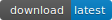

# OpenRAM

[](https://www.python.org/)
[](./LICENSE)

Master: [](https://github.com/VLSIDA/PrivateRAM/commits/master)
[]
[](https://github.com/VLSIDA/PrivateRAM/archive/master.zip)

Dev: [](https://github.com/VLSIDA/PrivateRAM/commits/dev)
[]
[](https://github.com/VLSIDA/PrivateRAM/archive/dev.zip)

An open-source static random access memory (SRAM) compiler.

# What is OpenRAM?


OpenRAM is an open-source Python framework to create the layout,
netlists, timing and power models, placement and routing models, and
other views necessary to use SRAMs in ASIC design. OpenRAM supports
integration in both commercial and open-source flows with both
predictive and fabricable technologies.

# Basic Setup

The OpenRAM compiler has very few dependencies:
+ [Ngspice] 26 (or later) or HSpice I-2013.12-1 (or later) or CustomSim 2017 (or later)
+ Python 3.5 or higher
+ Python numpy (pip3 install numpy to install)
+ flask_table (pip3 install flask to install)

If you want to perform DRC and LVS, you will need either:
+ Calibre (for [FreePDK45])
+ [Magic] + [Netgen] (for [SCMOS])

You must set two environment variables: 
+ OPENRAM\_HOME should point to the compiler source directory. 
+ OPENERAM\_TECH should point to a root technology directory.

For example add this to your .bashrc:

```
  export OPENRAM_HOME="$HOME/openram/compiler"
  export OPENRAM_TECH="$HOME/openram/technology"
```

You may also wish to add OPENRAM\_HOME to your PYTHONPATH:

```
  export PYTHONPATH="$PYTHONPATH:$OPENRAM_HOME"
```

We include the tech files necessary for [FreePDK45] and [SCMOS]
SCN4M_SUBM. The [SCMOS] spice models, however, are generic and should
be replaced with foundry models.  If you are using [FreePDK45], you
should also have that set up and have the environment variable point
to the PDK. For example add this to your .bashrc:

```
  export FREEPDK45="/bsoe/software/design-kits/FreePDK45"
```

You may get the entire [FreePDK45 PDK here][FreePDK45].
If you are using [SCMOS], you should install [Magic] and [Netgen].
We have included the most recent SCN4M_SUBM design rules from [Qflow].

# Basic Usage

Once you have defined the environment, you can run OpenRAM from the command line 
using a single configuration file written in Python. 

For example, create a file called *myconfig.py* specifying the following
parameters for your memory:

```
# Data word size
word_size = 2
# Number of words in the memory
num_words = 16

# Technology to use in $OPENRAM_TECH
tech_name = "scn4m_subm"
# Process corners to characterize
process_corners = ["TT"]
# Voltage corners to characterize
supply_voltages = [ 3.3 ]
# Temperature corners to characterize
temperatures = [ 25 ]

# Output directory for the results
output_path = "temp"
# Output file base name
output_name = "sram_{0}_{1}_{2}".format(word_size,num_words,tech_name)

# Disable analytical models for full characterization (WARNING: slow!)
# analytical_delay = False
```

You can then run OpenRAM by executing:
```
python3 $OPENRAM_HOME/openram.py myconfig
```
You can see all of the options for the configuration file in
$OPENRAM\_HOME/options.py


# Unit Tests

Regression testing  performs a number of tests for all modules in OpenRAM.
From the unit test directory ($OPENRAM\_HOME/tests), 
use the following command to run all regression tests:

```
   python3 regress.py
```
To run a specific test:
```
   python3 {unit test}.py 
```
The unit tests take the same arguments as openram.py itself. 

To increase the verbosity of the test, add one (or more) -v options:
```
   python3 tests/00_code_format_check_test.py -v -t freepdk45
```
To specify a particular technology use "-t <techname>" such as
"-t freepdk45" or "-t scn4m\_subm". The default for a unit test is scn4m_subm. 
The default for openram.py is specified in the configuration file.


# Porting to a New Technology

If you want to support a enw technology, you will need to create:
+ a setup script for each technology you want to use
+ a technology directory for each technology with the base cells 

All setup scripts should be in the setup\_scripts directory under the
$OPENRAM\_TECH directory.  We provide two technology examples for
[SCMOS] and [FreePDK45].  Please look at the following file for an
example of what is needed for OpenRAM:

```
  $OPENRAM_TECH/setup_scripts/setup_openram_freepdk45.py
```

Each setup script should be named as: setup\_openram\_{tech name}.py.

Each specific technology (e.g., [FreePDK45]) should be a subdirectory
(e.g., $OPENRAM_TECH/freepdk45) and include certain folders and files:
* gds_lib folder with all the .gds (premade) library cells:
  * dff.gds
  * sense_amp.gds
  * write_driver.gds
  * cell_6t.gds
  * replica\_cell\_6t.gds 
* sp_lib folder with all the .sp (premade) library netlists for the above cells.
* layers.map 
* A valid tech Python module (tech directory with __init__.py and tech.py) with:
  * References in tech.py to spice models
  * DRC/LVS rules needed for dynamic cells and routing
  * Layer information
  * Spice and supply information
  * etc.

# Get Involved

+ Report bugs by submitting [Github issues].
+ Develop new features (see [how to contribute](./CONTRIBUTING.md))
+ Submit code/fixes using a [Github pull request] 
+ Follow our [project][Github projects].
+ Read and cite our [ICCAD paper][OpenRAMpaper]

# Further Help

+ [Additional hints](./HINTS.md)
+ [OpenRAM Slack Workspace][Slack]
+ [OpenRAM Users Group][user-group] ([subscribe here][user-group-subscribe])
+ [OpenRAM Developers Group][dev-group] ([subscribe here][dev-group-subscribe])

# License 

OpenRAM is licensed under the [BSD 3-clause License](./LICENSE).

# Contributors & Acknowledgment

- [Matthew Guthaus] from [VLSIDA] created the OpenRAM project and is the lead architect.
- [James Stine] from [VLSIARCH] co-founded the project.
- Hunter Nichols maintains and updates the timing characterization.
- Michael Grimes created and maintains the multiport netlist code.
- Jennifer Sowash is creating the OpenRAM IP library.
- Jesse Cirimelli-Low created the datasheet generation.
- Samira Ataei created early multi-bank layouts and control logic.
- Bin Wu created early parameterized cells.
- Yusu Wang is porting parameterized cells to new technologies.
- Brian Chen created early prototypes of the timing characterizer.
- Jeff Butera created early prototypes of the bank layout.

If I forgot to add you, please let me know!

* * *

[Matthew Guthaus]:       https://users.soe.ucsc.edu/~mrg
[James Stine]:           https://ece.okstate.edu/content/stine-james-e-jr-phd
[VLSIDA]:                https://vlsida.soe.ucsc.edu
[VLSIARCH]:              https://vlsiarch.ecen.okstate.edu/
[OpenRAMpaper]:          https://ieeexplore.ieee.org/document/7827670/

[Github issues]:         https://github.com/VLSIDA/PrivateRAM/issues
[Github pull request]:   https://github.com/VLSIDA/PrivateRAM/pulls
[Github projects]:       https://github.com/VLSIDA/PrivateRAM/projects

[email me]:              mailto:mrg+openram@ucsc.edu
[dev-group]:             mailto:openram-dev-group@ucsc.edu
[user-group]:            mailto:openram-user-group@ucsc.edu
[dev-group-subscribe]:   mailto:openram-dev-group+subscribe@ucsc.edu
[user-group-subscribe]:  mailto:openram-user-group+subscribe@ucsc.edu

[Magic]:                 http://opencircuitdesign.com/magic/
[Netgen]:                http://opencircuitdesign.com/netgen/
[Qflow]:                 http://opencircuitdesign.com/qflow/history.html
[Ngspice]:               http://ngspice.sourceforge.net/

[OSUPDK]:                https://vlsiarch.ecen.okstate.edu/flow/
[FreePDK45]:             https://www.eda.ncsu.edu/wiki/FreePDK45:Contents
[SCMOS]:                 https://www.mosis.com/files/scmos/scmos.pdf

[Slack]:                 https://join.slack.com/t/openram/shared_invite/enQtNDgxMjc3NzU5NTI1LTE4ODMyM2I0Mzk2ZmFiMjgwYTYyMTQ4NTgwMmUwMDhiM2E1MDViNDRjYzU1NjJhZTQxNWZjMzE3M2FlODBmZjA
