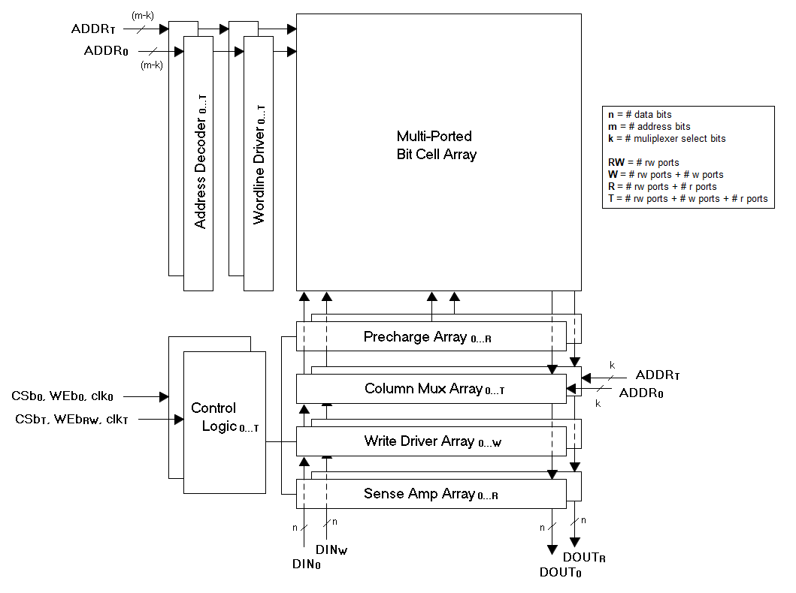

### [Go Back](./index.md#table-of-contents)

# Architecture
This page of the documentation explains the architecture of OpenRAM.

## Table of Contents
1. [SRAM Architecture](#sram-architecture)

## SRAM Architecture
* Bit-cell Array
    * Multiport Bitcells
* Each port:
    * Address Decoder(s)
    * Wordline Driver(s)
    * Column Multiplexer(s)
    * Bitline Precharge(s)
    * Sense Amplifier(s)
    * Write Driver(s)
    * Control Logic with Replica Bitline

## ROM Architecture
* Bit-cell Array
    * 1T NAND Bitcell
* Row Address Decoder
* Wordline Driver(s)
* Column Multiplexer
* Column Pre-Decoder
* Bitline Precharge(s)
* Control Logic