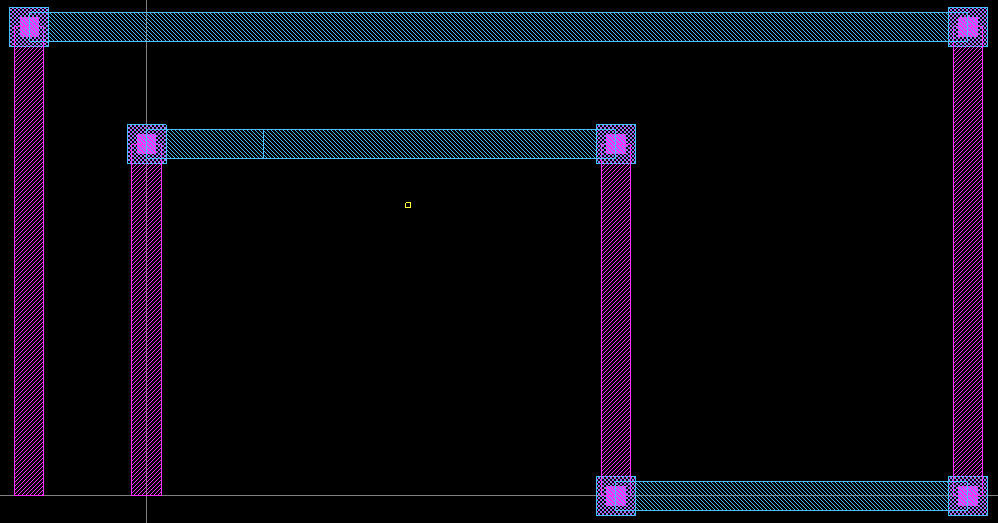
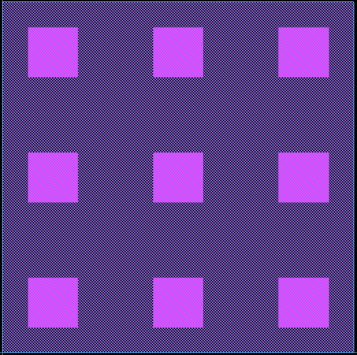
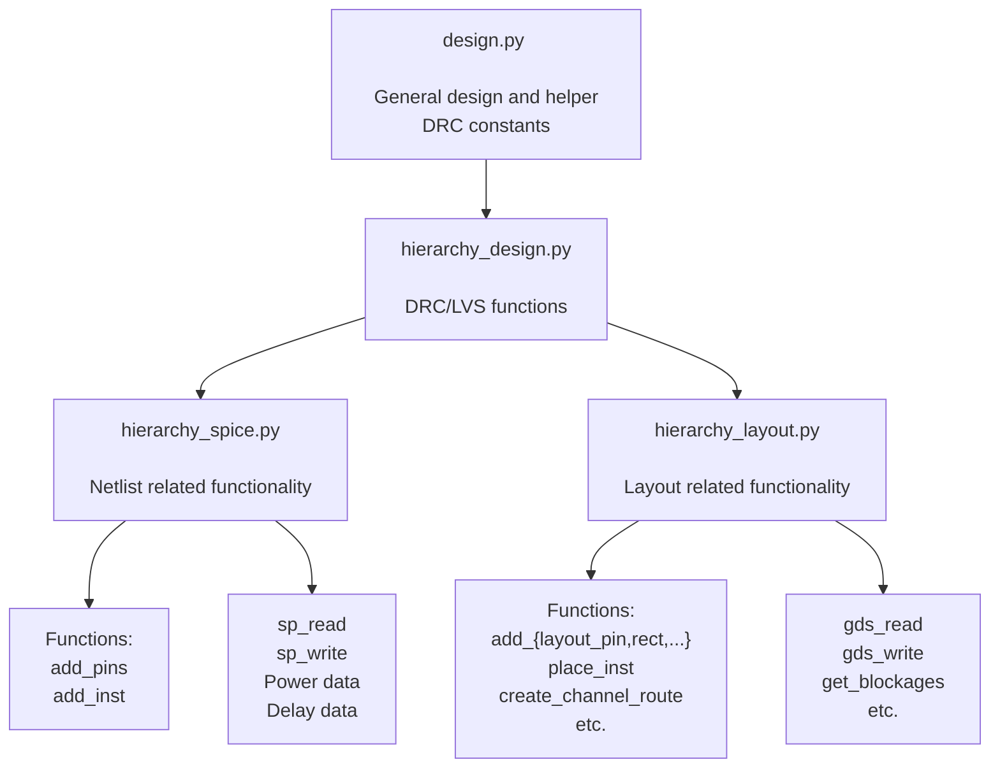
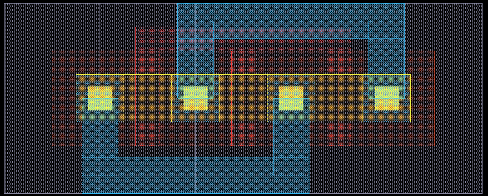
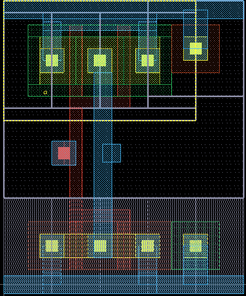

### [Go Back](./index.md#table-of-contents)

# Base Data Structures
This page of the documentation explains the base data structures of OpenRAM.

## Table of Contents
1. [Design Classes](#design-classes)
1. [Base Class Inheritance](#base-class-inheritance)
1. [Parameterized Transistor](#parameterized-transistor-ptx-or-pfinfet)
1. [Parameterized Cells](#parameterized-cells)

## Design Classes

* SPICE and GDS2 Interfaces
    * Custom cells (read GDS and SPICE)
    * Generated cells (creates GDS and SPICE "on the fly")
* Netlist functions
    * Add (directional) pins
    * Add and connect instances
    
* Layout functions 
    * Place instances
    * Add wires, routes, vias
    * Channel and Power router
* Verification functions (wrap around DRC and LVS tools)

## Base Class Inheritance

## Parameterized Transistor (ptx or pfinfet)

* Creates variable size/finger nmos or pmos transistor
    * Optional gate and source/drain contacts in naive way
    * Not optimal layout, but "good enough"
    * Offset (0,0) is lower-left corner of active area
* Size/fingers effect on size must be estimated elsewhere perhaps by trying configurations

## Parameterized Cells

Dynamically generated cells (in `$OPENRAM_HOME/pgates`)
* Not the most efficient layouts but "ok"
* Try to use restrictive design rules to keep them portable
* Transistors
    * `ptx`, `pfinfet`
* Logic gates
    *  `pinv`, `pnand2`, `pnand3`, `pnor2`
* Buffer/drivers
    * `pbuf`, `pinvbuf`, `pdriver`
* SRAM Logic
    * `precharge`, `single_level_column_mux`
