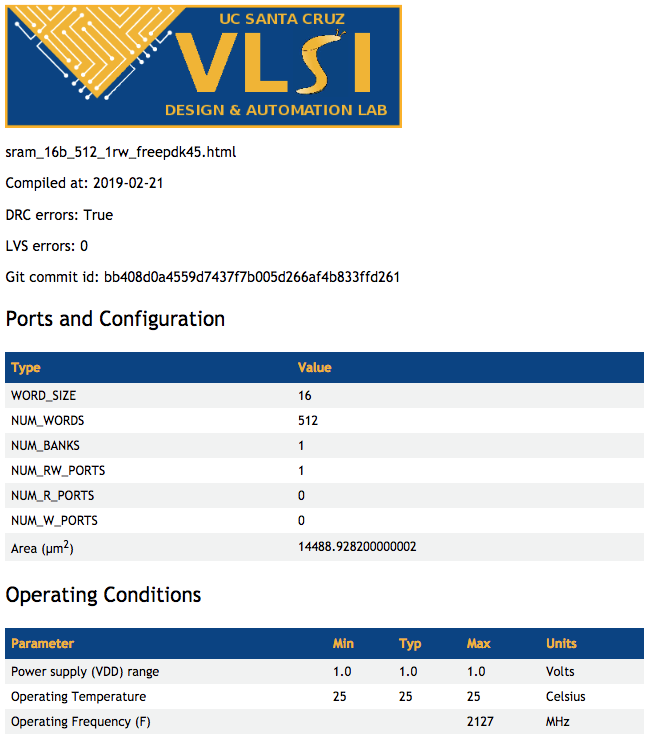
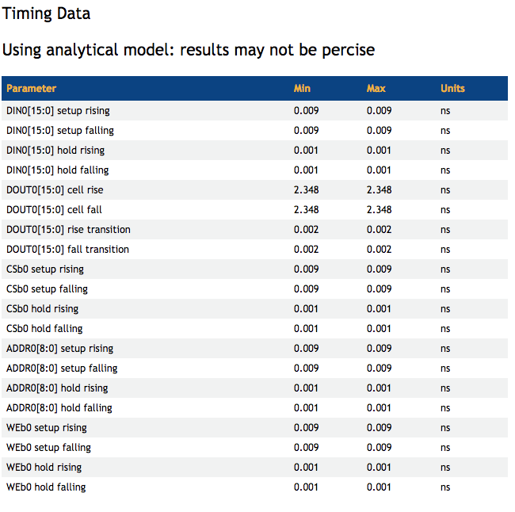
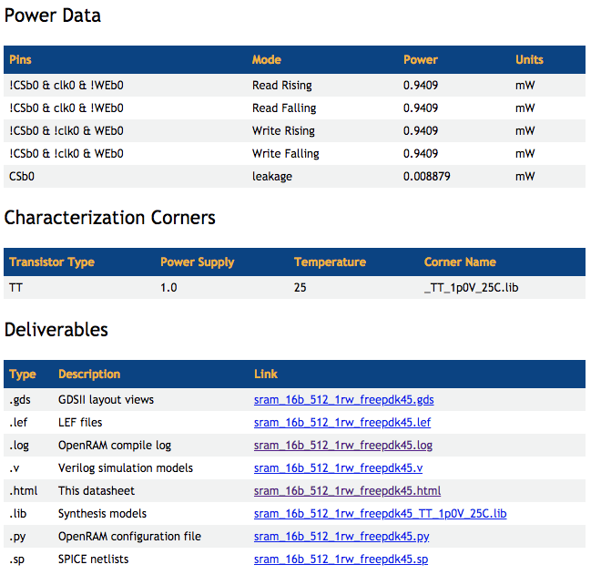

### [Go Back](./index.md#table-of-contents)

# Basic Usage
This page of the documentation explains the basic usage of OpenRAM's SRAM compiler. For usage of the ROM compiler see [here](./basic_rom_usage.md#go-back)


## Table of Contents
1. [Environment Variable Setup](#environment-variable-setup-assuming-bash)
1. [Command Line Usage](#command-line-usage)
1. [Script Usage](#script-usage)
1. [Configuration Files](#configuration-files)
1. [Common Configuration File Options](#common-configuration-file-options)
1. [Output Files](#output-files)
1. [Data Sheets](#data-sheets)


## Environment Variable Setup (assuming bash)
> **Note**: This is optional if you have the OpenRAM library. See
> [Python library](./python_library.md#go-back) for details.
* `OPENRAM_HOME` defines where the compiler directory is
    * `export OPENRAM_HOME="$HOME/openram/compiler"`
* `OPENRAM_TECH` defines list of paths where the technologies exist
    * `export OPENRAM_TECH="$HOME/openram/technology"`
    * Colon separated list so you can have private technology directories
* Must also have any PDK related variables set up
* Add compiler to `PYTHONPATH`
    * `export PYTHONPATH="$PYTHONPATH:$OPENRAM_HOME"`


## Command Line Usage
Once you have defined the environment, you can run OpenRAM from the command line
using a single configuration file written in Python. You can then run OpenRAM by
executing:
```
python3 $OPENRAM_HOME/../sram_compiler.py myconfig
```
You can see all of the options for the configuration file in
$OPENRAM\_HOME/options.py

To run macros, it is suggested to use, for example:
```
cd OpenRAM/macros
make example_config_scn4m_subm
```

* Common arguments:
    * `-h` print all arguments
    * `-t` specify technology (scn4m\_subm or scmos or freepdk45)
    * `-v` increase verbosity of output
    * `-n` don't run DRC/LVS
    * `-c` perform simulation-based characterization
    * `-d` don't purge /tmp directory contents


## Script Usage
OpenRAM is also available as a Python library. See
[Python library](./python_library.md#go-back) for details.


## Configuration Files
* Memories are created using a Python configuration file to replicate results
    * No YAML, JSON, etc.
* Complete configuration options are in `$OPENRAM_HOME/options.py`
* Some options can be specified on the command line as well
    * Not recommended for replicating results
* Example configuration file:
    ```python
    # Data word size
    word_size = 2
    # Number of words in the memory
    num_words = 16

    # Technology to use in $OPENRAM_TECH
    tech_name = "scn4m_subm"
    # Process corners to characterize
    process_corners = [ "TT" ]
    # Voltage corners to characterize
    supply_voltages = [ 3.3 ]
    # Temperature corners to characterize
    temperatures = [ 25 ]

    # Output directory for the results
    output_path = "temp"
    # Output file base name
    output_name = "sram_16x2"

    # Disable analytical models for full characterization (WARNING: slow!)
    # analytical_delay = False

    # To force this to use magic and netgen for DRC/LVS/PEX
    # Could be calibre for FreePDK45
    drc_name = "magic"
    lvs_name = "netgen"
    pex_name = "magic"
    ```


## Common Configuration File Options
* Characterization corners
    * `supply_voltages = [1.7, 1.8, 1.9]`
    * `temperatures = [25, 50, 100]`
    * `process_corners = ["SS", "TT", "FF"]`
* Do not generate layout
    * `netlist_only = True`
* Multi-port options
    * `num_rw_ports = 1`
    * `num_r_ports = 1`
    * `num_w_ports = 0`
* Customized module or bit cell
    * `bitcell = "bitcell_1rw_1r"`
    * `replica_bitcell = "replica_bitcell_1rw_1r"`
* Enable simulation characterization
    > **Warning**: Slow!
    * `analytical_delay = False`
* Output name and location
    * `output_path = "temp"`
    * `output_name = "sram_32x256"`
* Force tool selection (should match the PDK!)
    * `drc_name = "magic"`
    * `lvs_name = "netgen"`
    * `pex_name = "magic"`
* Include shared configuration options using Python imports
    * `from corners_freepdk45 import *`


## Output Files
The output files are placed in the `output_dir` defined in the configuration
file.

The base name is specified by `output_name` and suffixes are added.

The final results files are:
* GDS (.gds)
* SPICE (.sp)
* Verilog (.v)
* P&R Abstract (.lef)
* Liberty (multiple corners .lib)
* Datasheet (.html)
* Log (.log)
* Configuration (.py) for replication of creation


## Data Sheets



