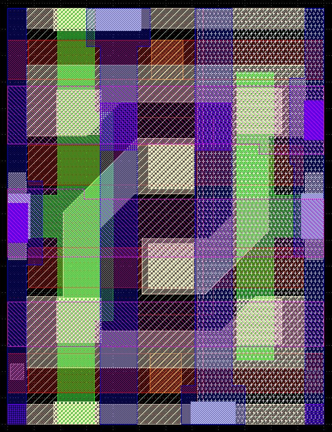
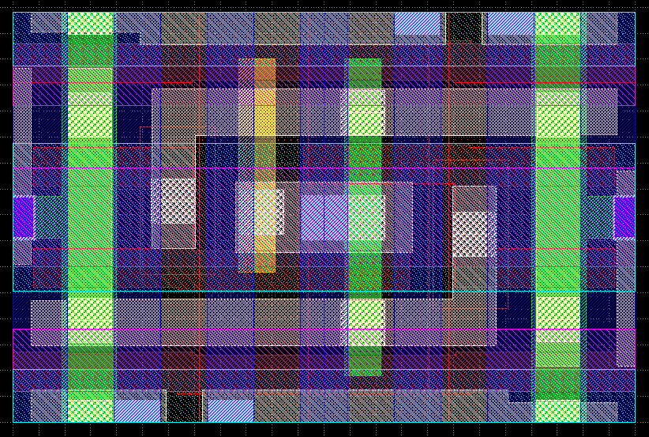
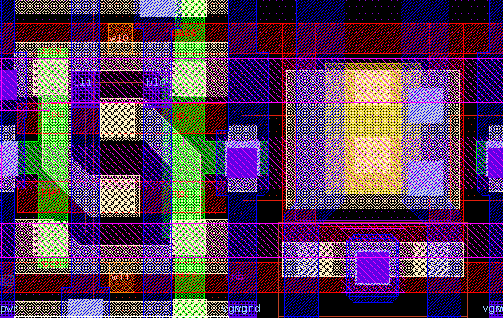
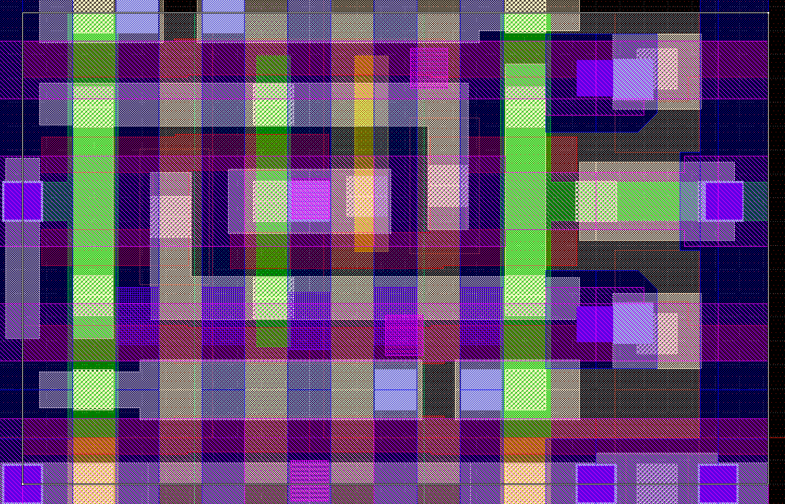
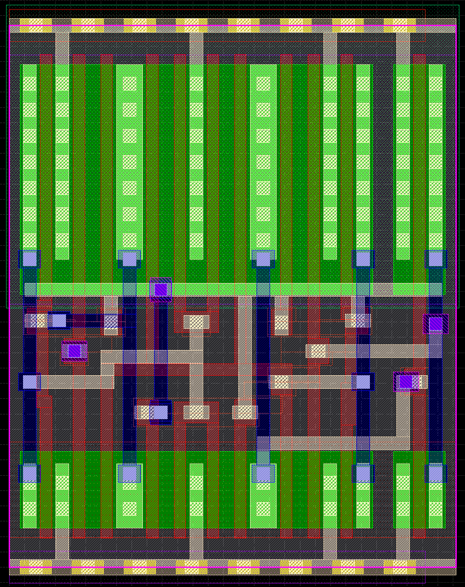

### [Go Back](./index.md#table-of-contents)

# Bitcells
This page of the documentation explains the bitcells supported by OpenRAM.

## Table of Contents
1. [Multiport Bitcells](#multiport-bitcells)
1. [Relative Bitcell Sizes](#relative-bitcell-sizes-035um-scmos)
1. [Thin SRAM Bitcells](#thin-sram-bitcells-130nm)

## Multiport Bitcells
* Based on 6T SRAM cell
    * Standard read-write
    * Isolated read-only ports
    * Write-only port (not sized for reads)
* Can accommodate foundry bitcells

## Relative Bitcell Sizes (0.35um SCMOS)
|  |  |    |
| :-----------------------------------------------: | :------------------------------------------------: | :--------------------------------------------------: |
| Standard 6T (1rw) 6.8um x 9.2um                   | Isolated Read 10T (1rw, 1r) 10.9um x 13.9um        | DFF 21.9um x 21.2um (from OSU standard cell library) |

## Thin SRAM Bitcells (130nm)
|  |  |    |  |
| :--------------------------------------------------------: | :------------------------------------------------------: | :-----------------------------------------------------------------: | :-------------------------------------------------------------: |
| Single Port 1.2um x 1.58um                                 | Dual Port 2.40um x 1.58um                                | Single Port (w/ straps & taps) 2.49um x 1.58um                      | Dual Port (w/ straps & taps) 3.12um x 1.97um                    |

|  |
| :----------------------------------------------------------: |
| DFF (for reference) 5.83um x 7.07 um                         |
