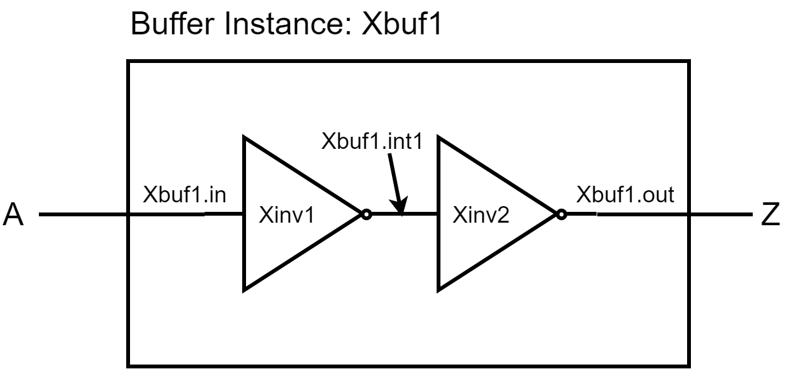
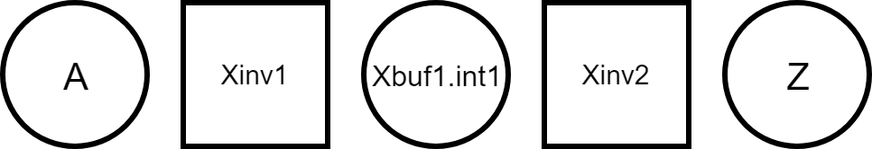
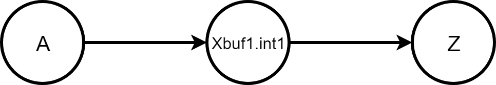
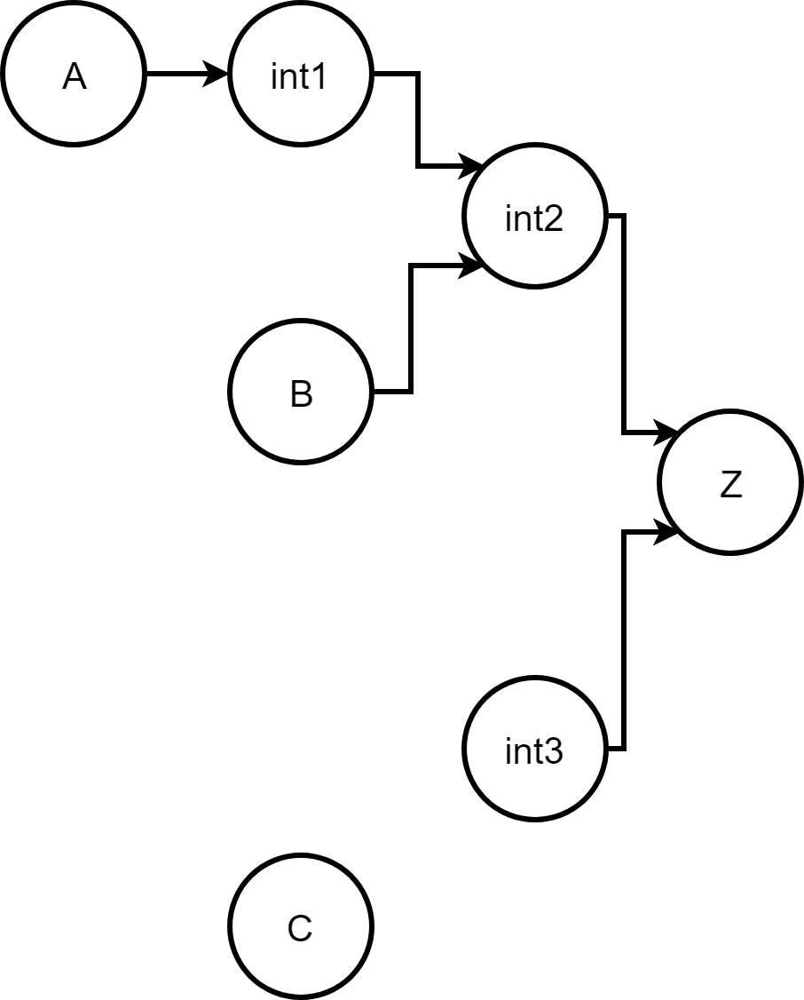

### [Go Back](./index.md#table-of-contents)

# Characterization
This page of the documentation explains the characterization of OpenRAM.

## Table of Contents
1. [Characterization Overview](#characterization-overview)
1. [Characterizer Organization](#characterizer-organization)
1. [Characterization Options](#characterization-options)
1. [Characterization Measurements](#characterization-measurements)
1. [Analytical Characterization](#analytical-characterization)
1. [Multiport Characterization](#multiport-characterization)
1. [Characterizer Unit Test Use](#characterizer-unit-test-use)
1. [Functional Simulation](#functional-simulation)
1. [Power/Delay Characterization](#powerdelay-characterization)
1. [Timing Graph](#timing-graph)
1. [Graph Creation Example: Buffer](#graph-creation-example-buffer)
1. [Graph Module Exclusion](#graph-module-exclusion)
1. [Timing Measurement Checks](#timing-measurement-checks)

## Characterization Overview
Measures the timing/power through SPICE simulation:	
* Generates the SPICE stimulus: The stimulus is written in standard SPICE format and can be used with any simulator that supports this. 	
* Runs the circuit simulations: To produce the average power, setup/hold times, and timing delay of the memory design. 
* Parses the simulator's output: The setup time, hold time, and delay are found using a bidirectional search technique. 
* Produces the output in a Liberty (.lib) file.

## Characterizer Organization
* Core Modules
    * `delay.py` - Generates the delays and power of input SRAM and corner
    * `setup_hold.py` - Generates setup and hold timing of DFFs by corner 
    * `lib.py` - Characterizes SRAM and builds Liberty file
    * `stimuli.py` - Generates SPICE stimulus file for characterization
* Auxiliary Modules
    * `simulation.py` - Base class for SRAM characterization modules
    * `trim_spice.py` - Removes portions of SRAM SPICE to speedup simulation
    * `measurements.py` -   Contains classes to aid SPICE measurements
    * `char_utils.py` - Contains common functions used during characterization
    * `logical_effort.py` - Helper class for analytical delay model 
* Testing Support Modules
    * Other modules are derivatives of the simulation module used in the unit tests

## Stand-alone Charaterizer
The stand-alone characterizer is a script ([sram_char.py]()sram_char.py) that can be run without generating an SRAM. 

## Characterization Options
* Characterization by Configuration File 
    * The process, voltage, and temperature (PVT) for characterization are defined in the config file.
    * Running OpenRAM generates a Liberty (.lib) file for every corner characterized.
    * Delays, slews, power determined for each input slew and outputs load combination in config file.
* OpenRAM Characterization Mode
    * Supports analytical and SPICE based characterization
    * Analytical characterization is default
    * SPICE characterization enabled with -c flag (requires SPICE simulator)

## Characterization Measurements
* Characterization is performed primarily to generate tables in .lib file
    * cell\_rise/cell\_fall - Delay of from negative clock edge to DOUT when reading a 1 or 0 respectively
    * rise\_transition/fall\_transition - Slew of DOUT when read 1 or 0 respectively
    * Setup and hold time for inputs (setup\_rising, hold\_rising)
    * Total power and leakage power
    * Delays and slews and intended to be independent of clock period.
    * Fall delays are copied to rise delays after characterization*
* Characterizer can help with debugging or optimization
    * Delay characterizer also produces Sense Amp Enable Timing to help debug read failures.
    * Delay class can edited or can be base class if other measurements are wanted.
> **Note**: Rise delays are dependent on the clock period if measured from negative clock edge due to precharge.

## Analytical Characterization
* Delay
    * Assumes a worst case delay through decoder, word line, and bit lines
    * Calculates RC delay at each stage using parameters for handmade cells, unit capacitances, and unit resistances which are defined in the technology setup
    * Output slews are estimated based on delays 
    * Wire delays only estimated for bitline delay
* Power
    * Dynamic power at each stage calculated using $C * V^2 * frequency$
    * Leakage power estimated with parameters in technology setup
* Corners add linear variations in delay and power

## Multiport Characterization
* Supports any port configuration specified by the configuration file
    * Any number of Read, Write, and Read/Write ports
    * Any custom bitcells may require modifications for characterization
* Characterization Algorithm
    * Feasible period found for each port
    * Common minimum period is found for all ports
    * Power and delay is characterized on each port
* Characterization Runtime
    * Ports are characterized separately for accuracy
    * Runtime increases linearly with ports and can be slow.

## Characterizer Unit Test Use
* OpenRAM will use the characterizer to generate data for .lib by default
* Characterizer modules can be instantiated separately from lib.py to generate and test data
    * Example: `21_ngspice_delay_test.py`
    * Delay module generates data to compare against previously generated data to error check any recent OpenRAM changes having a large effect on the delay
* Delay/Simulation module can be used as base class and altered to include custom measurements

## Functional Simulation
* Assumes uninitialized memory
* Random operations
    * Uses multiple ports when available
    * Read, write, or noop
    * Random address 
    * Random data
* Memory checks
    * Uses standard CMOS noise margins
    * Compares read with last write (or feed-through value if being written)

## Power/Delay Characterization
* Prunes unused portions of circuit for run-time
* Setup time, hold time, and delay are found using a bidirectional search.
    * Finds a feasible period
    * Iterates until convergence
* Dynamic and leakage measured
* Output saved in Liberty (.lib) file. 
    * Uses NLDM
    * Wish list: CCS

## Timing Graph
* OpenRAM has SPICE like modules and instances
* A timing graph is created using the SPICE netlist, names and paths through lower level modules.
* Graph used in characterizer for debugging timing issues associated with the Sense Amp Enable

## Graph Creation Example: Buffer

* SPICE instantiated module (vdd, gnd excluded from graph)
* Xbuf1 A Z vdd gnd Buffer
* Base module has its own naming for ports and internal signals

* Node names reduced to top-most SPICE level with internal signals maintained.
* Internal modules determine edges between nodes

* Most lower level modules (gates, PTX, FF, etc) determine edges by connecting every input  to every output by default.
* Custom timing paths can be overridden in any module

## Graph Module Exclusion
* Modules can be excluded from the graph before it's built
* This can help trim timing paths that are known to not affect the overall timing

|  |  |
| :-------------------------------------------------------------------------: | :----------------------------------------------------------------------------: |
| Graph without exclusion                                                     | Graph with exclusion                                                           |

## Timing Measurement Checks
In addition to measurements done for characterization. Several measurements are done to help debug memory failures.
* Bitline measurements - Voltage of bitlines measured the checked to have at least a 10% difference
* Bitcell Measurements - Voltage measured on internal storage of cells and check that they match the operation.
* Output voltage measurements - Output voltage (`DOUT`) checked at end of cycle so it matches operation.
* Sense Amp Enable Timing - Delay of `S_EN` should not exceed a half-period
