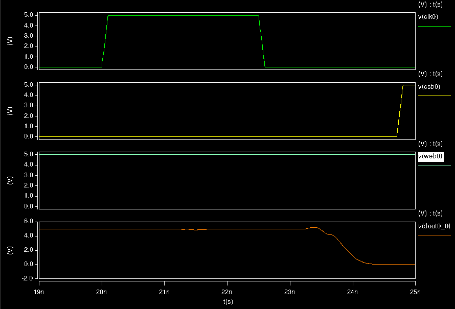
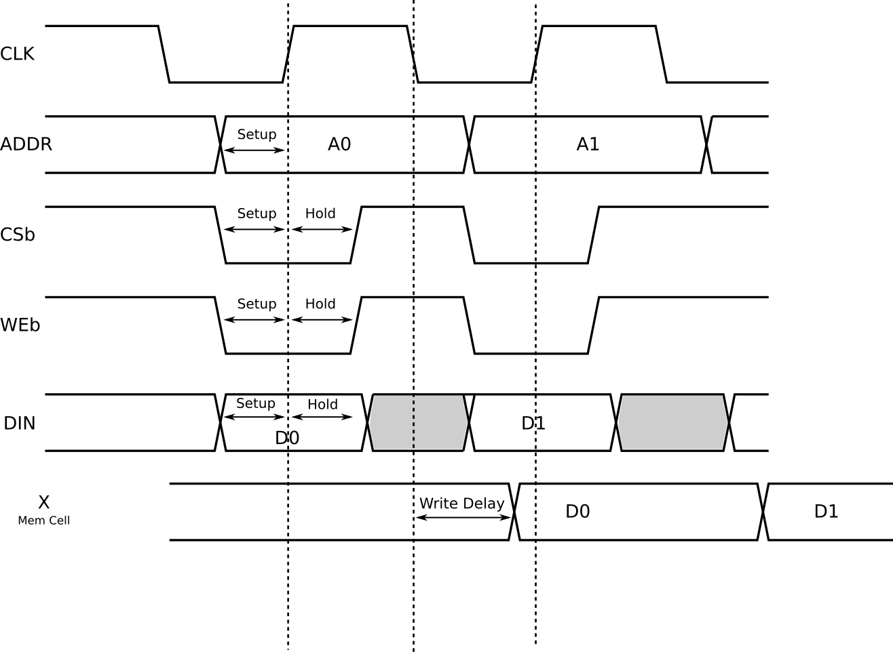
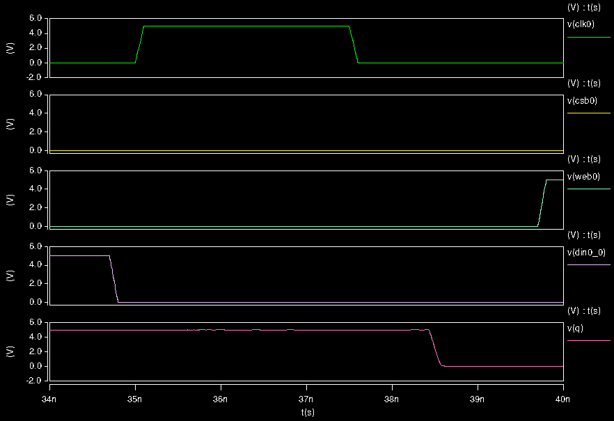
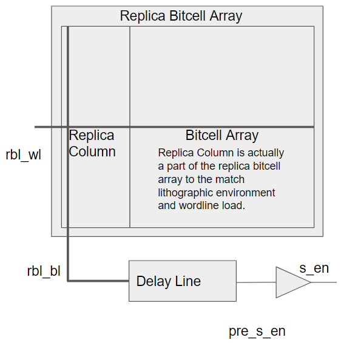
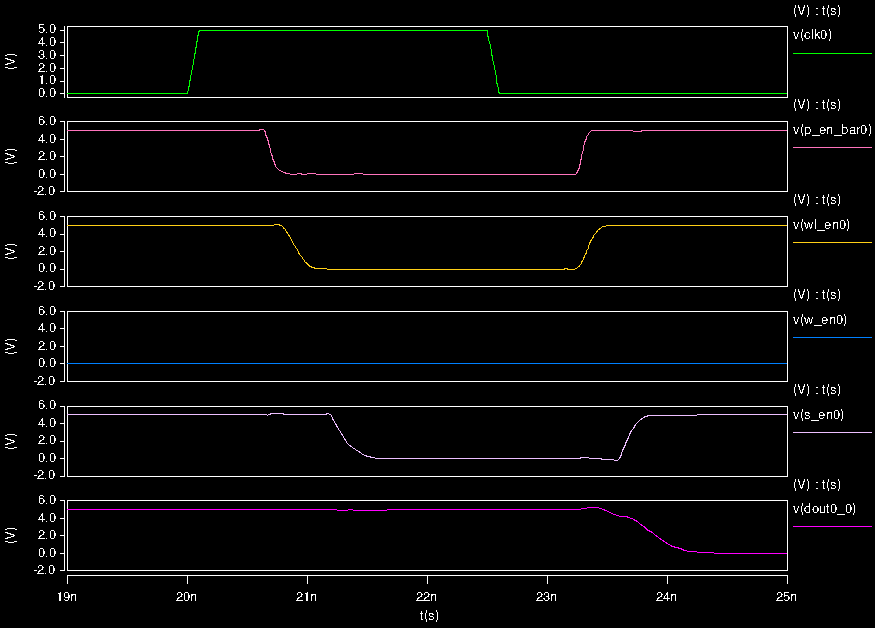

### [Go Back](./index.md#table-of-contents)

# Control Logic and Timing
This page of the documentation explains the control logic and timing of OpenRAM.

## Table of Contents
1. [Read Timing](#read-timing)
1. [Write Timing](#write-timing)
1. [External Control Signals](#external-control-signals)
1. [Internal Control Signals](#internal-control-signals)
1. [Replica Bitline (RBL)](#replica-bitline-rbl)
1. [Internal Control Signals Diagram (Read)](#internal-control-signals-diagram-read)
1. [Internal Control Signals Diagram (Write)](#internal-control-signals-diagram-write)
1. [Clock Distribution](#clock-distribution)

## Read Timing

### Read Timing Simulation

## Write Timing

### Write Timing Simulation

## External Control Signals
* Behaves as a synchronous register interface
    * Address and data captured on positive edge
    * Data is available after the negative edge (before next positive edge)
    * Clock is used for internal control generation
* Clock cycle
    * Clock high: capture inputs + precharge + decode
    * Clock low: read/write
* Reads and writes on multiple ports to the same address in the same cycle "feed through" but the noise margins of the bitcell must be able to handle this

## Internal Control Signals
* Sense Enable (`s_en`) -- Active high sense amp enable from Replica Bit Line (RB)
    * RBL input: `rbl_wl = gated_clk_bar & we_bar`
    * Delayed RBL output: `pre_s_en = DELAY(rbl_bl)`
    * Buffered enable: `s_en = BUF(pre_s_en)`
* Write Driver Enable (`w_en`) -- Active high write driver enable
    * `w_en = we`
    * `we` is directly from control flops
* Precharge Enable Bar (`p_en_bar`) -- Active low enable of precharge
    * `p_en_bar = !(gated_clk_bar)`
    * Active for writes as well to prevent half select destruction
* Word line enable (`wl_en`) -- Active high word line enable
    * `wl_en = BUF(gated_clk_bar)`

## Replica Bitline (RBL)

* Determines when to start sensing by replicating a bitcell array column
* Replica Bitline Column (RBC) matches transition of column
    * `rbl_bl = RBC(rbl_wl)`
* Delay Line delays the input signal to match word line driver
    * `pre_s_en = DELAY(rbl_bl)`
* Buffer drives `s_en` signal to sense amps

## Internal Control Signals Diagram (Read)

## Internal Control Signals Diagram (Write)

## Clock Distribution
* External clock (`clk`)
* Buffered clock (`clk_buf`) drives all DFFs in the design
    * `clk_buf = BUF(clk)`
* Buffered clock bar (`clk_bar`) used in control logic
    * `clk_bar = INV(clk_buf)`
* Gated Clocks (`gated_clk` and `gated_clk_bar`) used in control logic
    * This is LOW when disabled
        * `gated_clk_bar = cs && clk_bar`
    * This is LOW when disabled
        * `gated_clk = cs && clk_buf`
