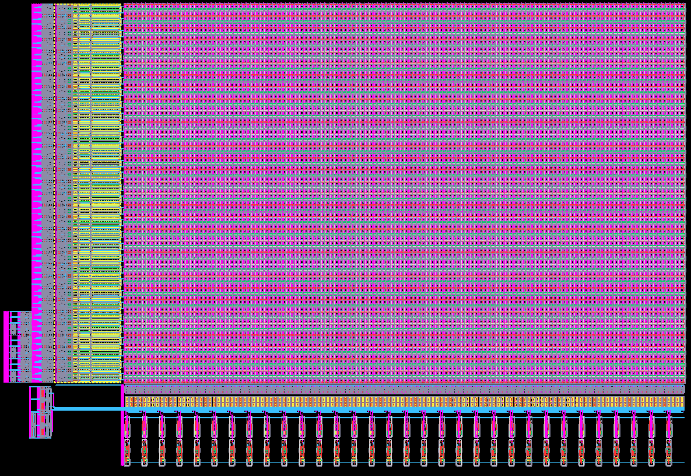
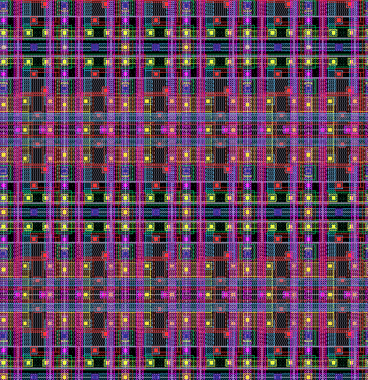
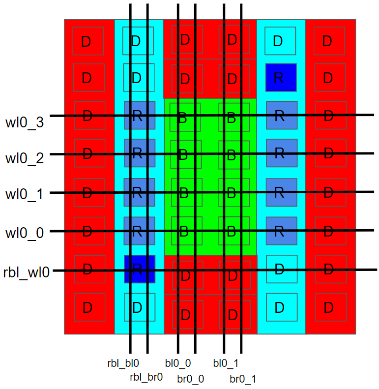
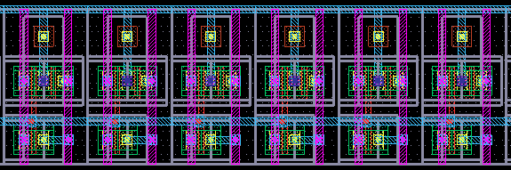
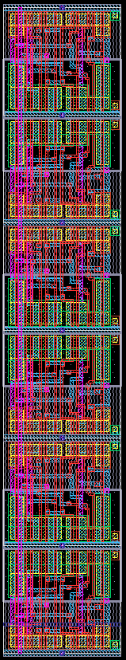
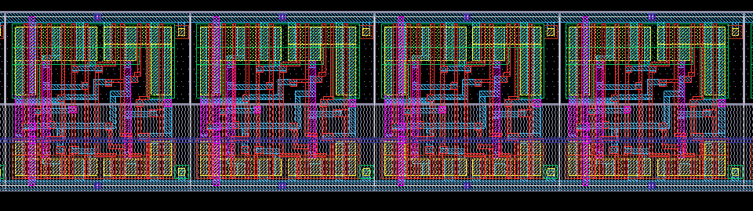
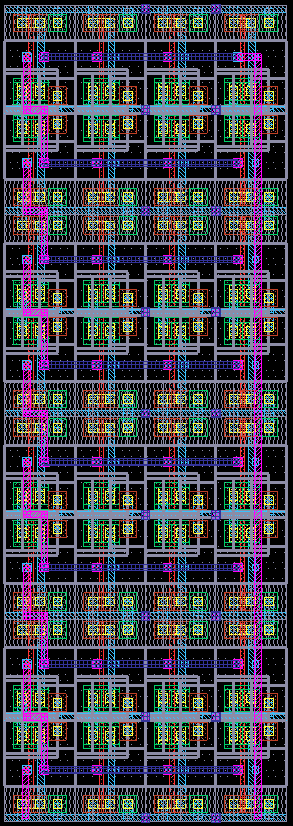
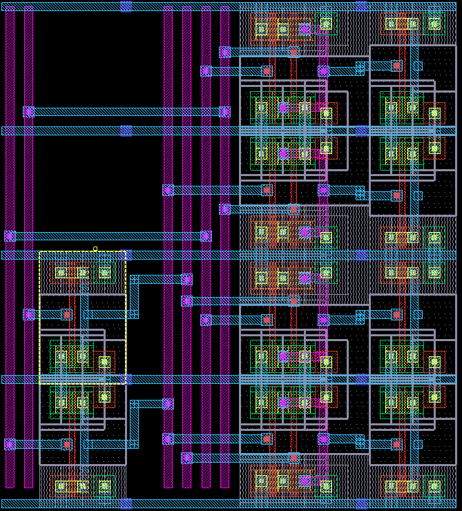

### [Go Back](./index.md#table-of-contents)

# Hierarchical Design Modules
This page of the documentation explains the hierarchical design modules of OpenRAM.

## Table of Contents
1. [Hierarchical Design Modules](#hierarchical-design-modules-1)
1. [Bank](#bank)
1. [Port Data](#port-data)
1. [Port Address](#port-address)
1. [Plain Bitcell Array](#plain-bitcell-array)
1. [Variations of Bitcells Needed](#variations-of-bitcells-needed)
1. [Replica Bitcell Array](#replica-bitcell-array)
1. [1D Arrays](#1d-arrays)
1. [2D Arrays](#2d-arrays)
1. [Delay Line](#delay-line)
1. [Hierarchical (Address) Decoder](#hierarchical-address-decoder)

## Hierarchical Design Modules
* Memory building blocks
    * SRAM, Bank, Control Logic, Decoders, Column Mux, Various arrays (DFF, drivers)
    * Can override every module with a custom one in the configuration file
* Each module must:
    * Create netlist
        * Define inputs/outputs
        * Instantiate and connect sub-modules and cells
    * Create layout
        * Place and route itself
        * Route vdd/gnd to M3
        * (Optional) Run DRC/LVS
    * Analytically model timing and power

## Bank

* Encompasses everything except
    * Data and Address Flops
    * Control logic
    * Multi-bank logic
* Arranges ports
    * Port 0 is left/bottom
    * Port 1 is right/top

## Port Data
* Encapsulates all of the datapath logic for a rw, w, or r port
    * Sense amplifiers (read types)
    * Write drivers (write types)
    * Column mux (if any)
    * Precharge (read or write type) (write to not destroy half selected cells in a row)
* Also includes a precharge for the replica columns

## Port Address
* Encapsulates the row decoder and wordline driver for easier placement next to a bank
* Each port will have its own port\_address module 

## Plain Bitcell Array

* 2D Array of bit cells
    * Each row alternately flips vertically
* Assume bitcells tile
    * Boundary is determined by boundary layer in GDS
    * Word line must abut
    * Bit lines must abut

## Variations of Bitcells Needed
* Normal bitcell for data storage
* Replica bitcell that is fixed to output a 0 value
* Dummy bitcell with bitlines disconnected (purely for wordline load and lithography regularity)

## Replica Bitcell Array
* Bitcells: B=regular, D=dummy, R=replica
* Main bitcell array ( $\color{green}{\textrm{green}}$ )
* Replica cols for each read port ( $\color{skyblue}{\textrm{blue}}$ ) on left or right (any number)
* Dummy bitcells on the top, bottom, left, and right for lithography regularity ( $\color{red}{\textrm{red}}$ )
* Replica columns activate two replica bitcells
    * $\color{blue}{\textrm{One}}$ driven by replica wordline
    * $\color{royalblue}{\textrm{Second}}$ driven by one of the normal wordlines (dark blue)
* Second port word and bit lines not shown
    * Would be on right and top

## 1D Arrays

* Several modules have 1D arrays:
    * `sense_amp_array`
    * `write_driver_array`
    * `precharge_array`
    * `single_level_column_mux_array`
    * `tri_gate_array`
    * `wordline_driver` (*should change name to _array)
* `sense_amp_array`, `write_driver_array`, `tri_gate_array` match column mux stride to space out
* Wish list: Allow wide sense amplifier array to use multiple rows of sense amplifiers.

## 2D Arrays
* Regular DFF arrays (`dff_array.py`)
* Buffered DFF arrays (`dff_buf_array.py`)
* Inverted DFF array (`dff_inv_array.py`)
* Can be $1*N$ or $N*1$ or $M*N$
    * Wish list: $M*N$ routes pins to edges

    

## Delay Line

* Configurable fanout and stages
    * `[4,4,4]` means 3 FO4 stages
    * `[1,1,4,4]` means 2 FO1 stages followed by FO4

## Hierarchical (Address) Decoder

* Generic `hierarchical_predecode` class
    * Places routing rails and decode inverters
* Derived to implement multiple predecoders
    * `hierarchical_predecode_2x4`
    * `hierarchical_predecode_3x8`
    * `hierarchical_predecode_4x16`
* Hierarchical decoder uses predecoder + another decode stage
* Predecoders are also used for the column mux decode and bank select decode
* Wish list: Handle thin bitcell height
