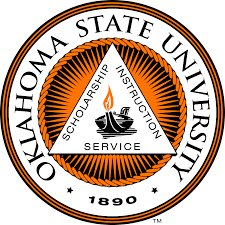
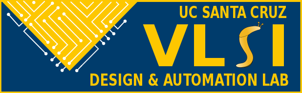

# OpenRAM Documentation

These pages provide the documentation of OpenRAM. You can use the links below to navigate through the documentation.

## Directory
1.  [Contributors/Collaborators](#contributorscollaborators)
2.  [OpenRAM Dependencies](#openram-dependencies)
3.  [Supported Technologies](#supported-technologies)
4.  [Bitcells](./bitcells.md#go-backindexmddirectory)
5.  [Architecture](./architecture.md#go-backindexmddirectory)
6.  [Implementation](#implementation)
7.  [Technology and Tool Portability](#technology-and-tool-portability)
8.  [Basic Usage](./basic_usage.md#go-backindexmddirectory)
9.  [Tutorials](./tutorials.md#go-backindexmddirectory)
10. [Debugging and Unit Testing](./debug.md#go-backindexmddirectory)
11. [Technology Setup](./technology_setup.md#go-backindexmddirectory)
12. [Library Cells](./library_cells.md#go-backindexmddirectory)
13. [Base Data Structures](./base_data_structures.md#go-backindexmddirectory)
14. [Hierarchical Design Modules](./design_modules.md#go-backindexmddirectory)
15. [Control Logic and Timing](./control_logic.md#go-backindexmddirectory)
16. [Routing](./routing.md#go-backindexmddirectory)
17. [Characterization](./characterization.md#go-backindexmddirectory)
18. [Results](./results.md#go-backindexmddirectory)

## Contributors/Collaborators

* Prof. Matthew Guthaus (UCSC)
* Prof. James Stine & Dr. Samira Ataei (Oklahoma State University)
* UCSC students:
    * Bin Wu
    * Hunter Nichols
    * Michael Grimes
    * Jennifer Sowash
    * Jesse Cirimelli-Low
    
* Many other past students:
    * Jeff Butera
    * Tom Golubev
    * Marcelo Sero
    * Seokjoong Kim

## OpenRAM Dependencies
* Python 3.6+
    * NumPy
* Spice Simulator
    * Ngspice 26 (or later)
    * Hspice  I-2013.12-1 (or later)
    * CustomSim 2017 (or later)
* DRC
    * Calibre 2017.3_29.23
    * Magic 8.x (http://opencircuitdesign.com/magic/)
* LVS
    * Calibre 2017.3_29.23
    * Netgen 1.5 (http://opencircuitdesign.com/netgen/)
* Git (any version)

## Supported Technologies
* NCSU FreePDK 45nm
    * Non-fabricable but contains DSM rules
    * Calibre required for DRC/LVS
* MOSIS 0.35um (SCN4M_SUBM)
    * Fabricable technology
    * Magic/Netgen or Calibre for DRC/LVS
    * 4 layers metal required for supply routing
* NCSU FreePDK 15nm & ASAP 7nm
    * In progress

## Implementation
* Front-end mode
    * Generates SPICE, layout views, timing models
        * Netlist-only mode can skip the physical design too
    * Doesn't perform DRC/LVS
    * Estimates power/delay analytically
* Back-end mode
    * Generates SPICE, layout views, timing models
    * Performs DRC/LVS
        * Can perform at each level of hierarchy or at the end
    * Simulates power/delay
        * Can be back-annotated or not

## Technology and Tool Portability
* OpenRAM is technology independent by using a technology directory that includes:
    * Technology's specific information
    * Technology's rules such as DRC rules and the GDS layer map
    * Custom designed library cells (6T, sense amp, DFF) to improve the SRAM density.
* For technologies that have specific design requirements, such as specialized well contacts, the user can include helper functions in the technology directory.
* Verification wrapper scripts
    * Uses a wrapper interface with DRC and LVS tools that allow flexibility
    * DRC and LVS can be performed at all levels of the design hierarchy to enhance bug tracking.
    * DRC and LVS can be disabled completely for improved run-time or if licenses are not available.