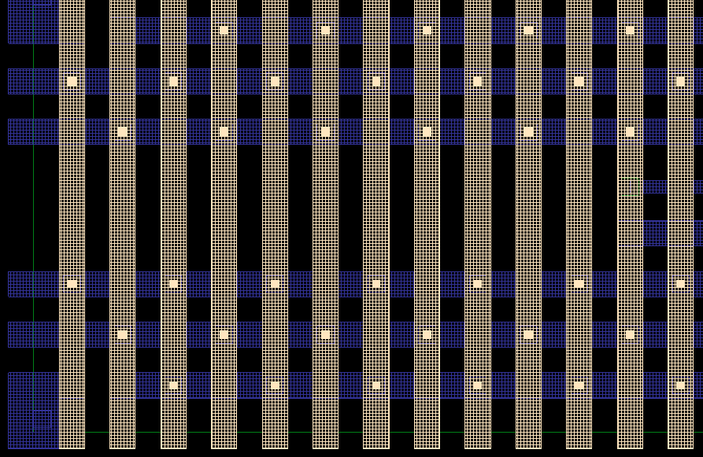
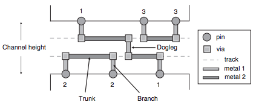
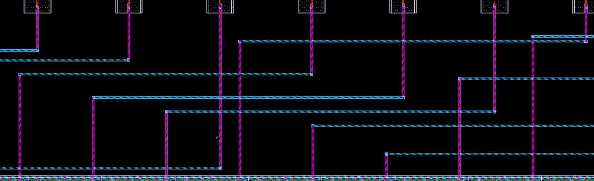

### [Go Back](./index.md#table-of-contents)

# Routing
This page of the documentation explains the routing of OpenRAM.

## Table of Contents
1. [Power Supply Options](#power-supply-options)
1. [Power Routing](#power-routing)
1. [Power Supply Algorithm](#power-supply-algorithm)
1. [Channel Router](#channel-router)

## Power Supply Options
* Unrouted
    * Leave must-connect metal 3 pins for vdd and gnd within the array
* Grid
    * Connect in a metal 3 and 4 grid
    * Blockage aware
    * Can encounter DRC errors with off-grid pins
    * Works with commercial tools but not so well with OpenRoad
* Work in Progress: Hanan Grid / Steiner Tree: 
    * Route tree on Hanan metal 3 and 4 grid instead of full grid
    * Blockage aware

## Power Routing

* All power pins are brought to M3 and routed as a grid on M3/M4
* Considers blockages of M3/M4 by control and data signals
* Considers wide/long metal spacing rules

## Power Supply Algorithm
* 1st: Route vertical and horizontal grids (blockage aware, allow connection to correct supply)
* 2nd: Check direct overlaps of power pins
* 3rd: Single direction probes to connect
* 4th: A* maze router

## Channel Router
* SRAMs typically try to use minimal layers of metal
    * Primarily used to connect decoders, input/output circuitry, or control logic
* Wish list
    * Minimize number of tracks
    * Must consider impact on floorplan

|            |  |
| :-------------------------------------------------------------------------: | :---------------------------------------------------------------------: |
| Credit: Chen & Chang, EDA Handbook, Chapter 12, Global and detailed routing | Sense amp to data flop connection                                       |
